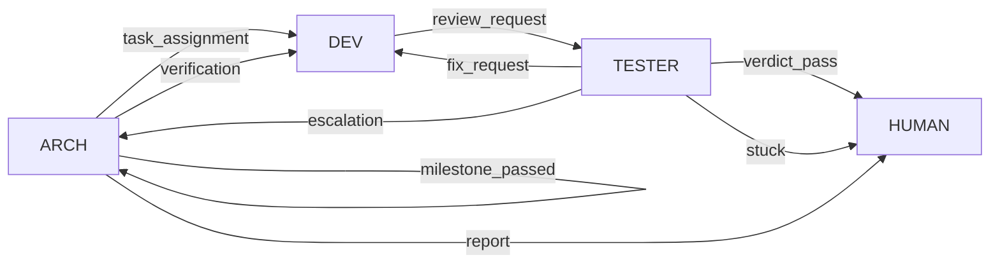

# 消息协议（生成物，勿手改）

> 由 `npm run docs:protocol` 从 `src/protocol/routes.ts` 生成。**改表，不改本文件。**
>
> 老仓库有一份手写的同类文档，它跟实现分裂过而没有任何信号——
> `ticket_result` 那条通道在文档里活得好好的，实现却把消息投去了别处。
> 所以这里的一致性由 `git diff --exit-code` 保证（plan.md M2 有对应断言）。

## 通道表

| type | 方向 | 必填 | 触发 |
|---|---|---|---|
| `task_assignment` | arch → dev | `milestone` `body` | 分配里程碑给 dev |
| `verification` | arch → dev | `milestone` `body` | 要求 dev 核对/补证（不改变轮次） |
| `review_request` | dev → tester | `milestone` `body` `artifact` | 开发完成，请求验收 |
| `fix_request` | tester → dev | `milestone` `issues` `artifact` | 验收 FAIL，发回修复 |
| `verdict_pass` | tester → human | `milestone` `questions` `artifact` | 自动验证通过，等人答 [human] 断言 |
| `milestone_passed` | arch → arch | `milestone` `evidence` | (人的代理)人工放行，进入收尾/下一里程碑 |
| `escalation` | tester → arch | `milestone` `body` | 同问题反复或架构疑点，升级 arch |
| `stuck` | tester → human | `milestone` `body` | 连续失败达上限，请人介入 |
| `report` | arch → human | `body` | 状态/收尾报告（无里程碑上下文） |

共 9 条。`to` 由 `type` 决定，不由调用方传——所以「发错地址」在类型层面无从表达。

## 流转图

## 各角色可发的 type

`send_task` 的参数 schema 按角色生成，所以越权在类型层就不可能——
dev 的 schema 里没有 `arch` 这个选项，不需要运行时拦截。

| 角色 | 可发 | schema 必填 |
|---|---|---|
| arch | `task_assignment` `verification` `milestone_passed` `report` | `type` |
| dev | `review_request` | `milestone` `body` `artifact` |
| tester | `fix_request` `verdict_pass` `escalation` `stuck` | `type` `milestone` |
| human | —（伪角色：有收件箱、无窗口） | — |

## 收件箱

单槽位文件，一个角色一个。语义与取舍见 `src/channel/inbox.ts` 文件头。

- arch → `.pi/messages/to-arch.json`
- dev → `.pi/messages/to-dev.json`
- tester → `.pi/messages/to-tester.json`
- human → `.pi/messages/to-human.json`

