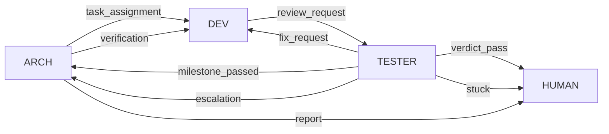

# 三窗口工作流：思维与机制的对照

> **这份文件是注解版**。primary source 是同目录的 `diccussion.md`（2026-08-21 写给别人的聊天记录，
> 含重复段落与口语，一字未改）——按本项目自己的纪律，第一手材料不改写，只引用。
> 建议把原件改名为 `2026-08-21-chat-raw.md` 以标明性质，但**不要编辑它的内容**。
>
> 本文的结构是三段式：**原话**（当时怎么想）→ **机制**（落在哪个文件/断言/纪律）→
> **事后**（后来真实发生了什么）。第三段是这份注解的全部价值：它写在 M6.6 判 FAIL 之后，
> 而原话写在之前。

## 时间坐标：这份记录站在哪

| 日期 | 事件 |
|---|---|
| 08-20 | 澄清 + 断言逐条签字 + 架构八份 |
| **08-21** | **本记录写下**：原话「以上是开发的还算顺利的阶段」 |
| 08-22 | **M6.6 真开三窗口，判 FAIL**：唤醒链路从未接线，人手动踢了 47 分钟 |
| 08-23 | M6 验收，6/6 通过 |

**这份记录写在"还算顺利"与"判 FAIL"之间的那一天**——落差本身就是整篇文章的脊梁。

---

## 一、起念：跟风与不跟风的分界

> 「首先我当时跟风吗，看 subagent 概念和多 agent 协作的概念抄的很火，b 站头部的 ai 博主当时也出来了一套东西……我看 pi 的可玩性很高，就试着用 pi 复现了这么个东西。」

**机制**：无。这是动机，不落代码——但它决定了初始角色数（三个）。

**事后**：起念是跟风，执行不是。三处证据都是跟风者走不到的地方：

1. **重构了**：跟风者在"文件夹结构都看不明白"时放弃或继续糊
2. **引入人工省 token**（「人穷志短，穷则思变」）：demo 不付账，所以 demo 不会有这个设计
3. **技术选择整体反潮流**：潮流给编排框架、消息总线、MCP；你选了三个 OS 进程 + 磁盘文件 + 文件系统事件 + 无锁单槽位——**这是 Unix 的答案，不是潮流的答案**

**但有一处跟风痕迹留下了：arch**。你的第一原理 D-01（生产者不能宣布自己完成）只推得出**两个**角色：生产者 + 判定者。第三个角色不是从失败分析长出来的，是从"多智能体 demo 都有一个 planner"的形状来的。证据是它现在的职责——分发（`FLOW` 状态机就能做）、转发 escalation、写规划书（但 D-15 明说只有人能改断言）、压缩文件（机械操作）：**没有一件必须是 LLM**。后来给它加"完成后压缩文件"，恰恰说明这个窗口在找活干。

---

## 二、通信机制：一条一条对齐

### 三个独立进程，零网络零中间件

> 「三个独立的 pi 进程（三个窗口），零网络、零中间件，靠『磁盘文件 + OS 文件系统事件』实现消息传递。」

**机制**：`src/channel/watch.ts`（`fs.watch` 低延迟 + `setInterval` 10s 轮询兜底，双通道）；`src/channel/paths.ts` 定义磁盘布局——**人读的进 `wf/`，机器水位进 `.pi/messages/`**（老仓库把计数混在 `logs/` 里，那个目录既是产物又是资产）。

**事后**：**这一条是 M6.6 判 FAIL 的正中心**。`watchInbox` 在 `src/adapter/` **零调用**，`git log -S "watchInbox(ctx.cwd"` 为空——**从未接线过**，不是回归删除。`status.ts:11` 的注释写着「wire 的 session_start / watchInbox 共用同一份」：**设计写了，实现没做，289 个用例和 11 次审计都没抓到**。M6-010（`974ed40`）才补上。

这是 D-02 最精确的形态：**写了但没接线**。而抓到它的不是任何自动机制，是一条人写的 `[human]` 断言。

### 角色由环境变量激活

> 「角色由环境变量激活」

**机制**：`src/adapter/activate.ts` 三态判定——env 等于本文件角色→激活；是其它已知角色→**静默**（pi 全量加载三个入口是正常情况）；未知值→**告警**；空→静默（单窗口降级合法）。`extensions/{arch,dev,tester}.ts` 各 19 行薄壳。

**事后**：两次真实事故。`066b617` 修 pi 全量加载导致的噪音告警（三态判定就是这次重构出来的）；`348bc3a` 修 `trio.ps1` 的 `set` 尾随空格——`WF_ROLE="dev "` 导致窗口静默不激活，**这是老仓库那个"半天排查"事故的原样复现**，而老仓库宪法里它是"唯一标注记录了但没修"的条目。所以 `activate.ts` 打印 `JSON.stringify(env)`：空格可见。

### 单槽位严格串行

> 「『单槽位』确保严格串行（懒得在原型阶段搞锁）」

**机制**：`src/channel/inbox.ts`，测试 C7-overwrite-warn（覆盖时告警）。

**事后**：**这句原话是全文最有价值的一句**。`inbox.ts` 的文件头现在把单槽位写成了一个有取舍论证的设计决策——两者都是真的，但真实顺序是：**偷懒 → 恰好 work → 事后被论证成设计**。按 D-13 双条件它不够格进 `decisions.md`（没人主张过替代方案），所以降级为注释——而降级后，"懒得搞锁"的来源就从记录里消失了。

**写文章保留这句原话**：它是"事后合理化"的自证样本，而这类项目最普遍的病就是这个。

### send_task 工具化投递

> 「通信如果让 ai 来太不可靠了，所以注册了 send_task 工具送」

**机制**：`wire.ts` 的 `registerTool` + `src/protocol/routes.ts`（9 条路由，**`to` 由 `type` 决定，不由调用方传**）+ `schema.ts`（schema 按角色生成，dev 的 schema 里没有 `arch` 选项，越权在类型层无从表达）。

**事后**：这条判断完全正确，而且推出了 `decisions.md` 里的第 2 条决策——PASS/FAIL 拆成两个 type，因为一个 type 两个目标地址就只能在代码里 `if` 分流，而那正是老仓库 `ticket_result` bug 的栖息地（七处声明这条通道存在、零处让它工作）。

**但**：M6 修复轮发现 **schema 缺 `artifact` 字段**，tester 带 artifact 投递被 `additionalProperties: false` 拒——**tester 无法投递**。E1 测试直调 `execute` 绕过 schema 校验，所以测试全绿、真窗口炸。修复后 E1/A9 改走真实调用路径（`7fc3b25`）。

### 原子写

> 「writeMessage 原子写」「原子写 │ .tmp + rename │ 半写消息 / 读取竞态」

**机制**：`src/channel/atomic.ts` 是**唯一**允许出现 `writeFileSync` 的文件。M1 有 grep 断言查这件事，**注释也算违反**（改名时 grep 不到注释里那个）——而它真的在 `routes.ts` 的一句注释里抓到过一次。

**事后**：零缺陷。这是 `reuse.md` 里"事故换来的实现，逐字照抄"清单中的一项。

### mtime 去重

> 「mtime 去重│ .processed-{role} 文件│ 窗口重启后重复处理同一条消息」

**机制**：`paths.ts` 的 `processed(role)`（mtime 数字），测试 C3-watermark + C1-startup-catchup。

**事后**：零缺陷，同属照抄清单。**照抄的部分全部零返工，长出来的部分全部有事故**——这个对比本身值得写一节。

### 唤醒：往自己会话注入用户消息

> 「收件时候 watchInbox 往自己会话里注入用户消息唤醒 LLM」

**机制**：`sendUserMessage(..., { deliverAs: "followUp" })`。

**事后**：三次事故，全部在这一条上。
- **A9c 死循环**：`agent_end` 提醒触发 followUp，followUp 又触发 agent_end。修了两轮才对——第一版 mock 用 `string` 形态，真实是**数组**形态，停止条件在真实形态下不生效（`c8f31e3`/`66943f3`）
- **`ctx.mode` 守卫**（`0b95822`）：`--print`/rpc 模式不该发 `sendUserMessage`
- **M6.6 的根因**：这条链**从未接线**

**唤醒是全项目事故最密集的一条线**，而它也正是"三窗口协作"的命门：消息落盘而无人被唤醒，整条流水线静默停住。

### handoff 冷启动记忆

> 「每轮写 logs/handoff-{role}.md；启动时 bootBriefing() 自动弹『接管简报』（状态+交接+最近产出+git 脏状态）」

**机制**：`src/adapter/status.ts` 的 `bootBriefing()`，四行：状态（里程碑/轮次/失败计数）、未决（frontier 分组条数）、待人工（人的收件箱）、降级提示（`test: null` 时常驻）。纪律 D-30：**需要人主动去打开才能看见的待办 = 无效载体**。

**事后**：路径变了——原话的 `logs/handoff-{role}.md` 在重构后分成 `wf/`（人读、进 git）与 `.pi/messages/`（机器水位、进 .gitignore）。**这是记录里唯一一处"当时的形态已被重构掉"的地方**，也是重构确实发生过的物证。

---

## 三、你当时写下的最小核心——后来证明它是对的

> 「往后面想要复刻到其他项目上应该也很简单：一个消息目录，发送原语和接收原语，角色激活再加上 handoff 文件作冷启动记忆；基本就能迁移过去了。」

**机制对照**：这四件东西 = `channel`（258 行非注释）+ `protocol`（253）+ `activate.ts` + `status.ts` ≈ **600–700 行**。

**事后**：而最终形态是 7 层、`src` 3291 行、`tests` 6135 行、5 个脚本、16 份文档。

**这句话写在 8-21，比"判定机制与三窗口解耦"的想法早了三天**——也就是说：**你早就知道核心很小**。中间那一万行不是设计意图，是**累积过程**。文章里这句必须原样引用，因为它证明"过度"不是判断失误，是熵。

---

## 四、规划书：你说它至关重要，机制回答了几问

> 「但是这个流程里有个东西至关重要：任务规划书。怎么分层，怎么验证，怎么确保机制落地了，怎么不让它目标漂移了，怎么让项目不要过耦合了，测试有没有问题，所有的原则有没有违反，测试结果会不会假阳性/假阴性。」

这六问逐个对应到机制，答得相当完整：

| 你的问题 | 机制 |
|---|---|
| 怎么分层 | 里程碑 + 断言语法 S1–S7（`plan/grammar.ts` 唯一定义处） |
| 怎么验证 | `[auto]`/`[human]` 二分（D-20）；`[auto]` 须含命令或路径 |
| 怎么确保机制落地 | **D-02 + 纪律表的「落点」列**：写"规约"= 明确承认它会被跳过 |
| 怎么不目标漂移 | D-14（已 PASS 的里程碑节冻结）+ D-15（断言只有人能改）+ `assertionHash` |
| 怎么不过耦合 | 依赖图严格单向 + D-07（pi 只以类型存在）+ A9 |
| 假阳性/假阴性 | D-25（测试输入走真实解析路径）+ T10（老仓库四份真实报告全部 block）+ L9（老仓库规划书解析失败且带行号） |

**一个缺口**：机制全在**验证**规划书，没有一处**生产**规划书。plan 的质量完全取决于那次澄清对话，而澄清只有散文规约（D-10/D-11/D-21/D-24），没有结构。

**这是全系统唯一一处"你自己说至关重要、却只有散文没有机制"的地方。** 要补的时候，`grilling` 那 28 行的形状（轮次 + frontier + 事实归模型/决策归人）是现成的，而且它和 D-10 的「能不能精确陈述」是同一个判据。

---

## 五、失控与重构：一份写在两天前的病历

> 「说实话一开始我以为就是加一个小功能：superpowers 里的 brainstorm 和 grill-with-docs，很常用的 skill 不是吗。直到我看不明白优化，花在测试验证和文件比本体代码都高了，文件夹结构都看不明白为止我都觉得是小问题，然后我重构了整个项目。」

**机制/数字**：非注释统计 `src` 1913 / `tests` 4238 = **比值 2.24**。前身死因是 1995 vs 1898 = **1.05**。

**事后**：D-41 这条纪律（自检不得超过运行时）拿到了机制（`check:testsize`），然后**审了十一次，阈值一次没动，红线从第一次运行起就是红的**：

`1.71 → 1.95 → 2.09 → 2.28 → 2.19 → 2.22 → 2.21 → 2.22 → 2.25 → 2.25 → 2.24`

三个可写的点：
1. **永久红、永不 exit(1)**。设计理由是"做成硬失败会逼人改数字"，结果是一条永远亮着的红灯。它是仪表还是仪式？
2. **推迟的措辞制造了推迟**。第二次审记下"L7 偏大"，第三次审写"下次红了先看它"——它从 182 行长到 236 行。改口为"升级为下个里程碑开工前第一件事"才真的还掉。
3. **第十次审推翻第九次审**：同一判据（真实行为 vs 仪式）在错误的 mock 形态上给出过错误结论。**审计机制自己需要被审计。**

**这段原话的价值在时间戳**：它写在 8-21，比任何外部意见都早。有它在，复盘就不是"被批评后的检讨"，是**作者自己的病历**。

---

## 六、渐进式披露与只增不改的台账

> 「所以我把几条经验写入了纪律，agents.md 进来能看到的是大概项目情况，plan.md 和 displine.md、readme.md 依赖图。让 agents.md 当目录，把要看的选看的不看的列出来，也算是一种 skill 式的渐进式披露了，可以说这个骨架打的很扎实了。」

**机制**：`AGENTS.md` 三档（每次都读 / 按需 / 默认不读）+ `docs/disciplines.md` 36 条（每条带判据 + 落点）+ D-48（拿到常驻机制的条目离开读序）。

**事后**：骨架确实扎实——这套三档披露是全项目最省心的部分，重构时靠它 + git 才能改得动。

但台账本身有一处结构性问题：**只增不改（D-47）意味着它只会变长**。而 D-47 自己的来源是个绝妙的讽刺——`42bd0e7` 那个提交的 message 是「纪律 +1：D-45 一个提交一件事」，而**它自己把 D-44 整行替换掉了**，违反的是同一份文件表头第三条。两个提交无人发现，直到补 D-47 + 检查器才被抓出来，如今在 `ALLOWED_DELETIONS` 里记为历史事故。

**纪律的宣布行为本身不受纪律约束**——这是 D-02 最讽刺的形态，而它发生在 D-02 已经写下之后。

---

## 七、「但是还是有问题」——问题清单的当前状态

> 「arch 多了一个在完成任务以后把文件压缩的功能，避免上下文污染；但是还是有问题，这是我目前的进度。」

原话结尾的"还是有问题"，三天后有了具体答案：

| 问题 | 状态 |
|---|---|
| 唤醒链路 | **M6.6 判 FAIL 的根因**，M6-010 已修（`974ed40`） |
| schema 缺字段 / P1 自检未挂 / followUp 死循环 | M6 修复轮全修（`15c4cb6`/`40a0a42`/`8249bef`） |
| arch 职责空心（压缩文件是在找活干） | **未解**：解耦后最先能退场的就是它 |
| 规划书只有验证没有生产 | **未解**：澄清仍是散文 |
| 比值 2.24 / 元机制 25% 体量 | **未解**：收缩清单已列 |

---

## 八、验收之后：外部干涉与 dev 的过度思考（08-24）

> 时间坐标追加：08-23 M6 验收 6/6 之后。本段记录**验收后的第一次真实使用**——
> 项目外的人/帮手在窗口外做的两件事，如何改变了一个窗口的行为。

### 现象

M6 验收后，帮手替 dev 修了一处收尾回归（L6 前提断言，`d10d1eb`，commit message 注「人直接指令」），
并在此之前把 dev 的思维过程逐段解剖评论（「引用错教训」「越权纠结」「思考死循环」）。
随后 dev 窗口的行为变了：在**没有任务**的会话里，它收到 agent_end 提醒「若已完成请投递」后，
陷入多轮自我审查——反复确认「这轮有没有任务」「d10d1eb 是不是我提交的」「时间线为什么对不上」
「投递会不会被 G_artifact 拦」，绕了数圈才给出与第一直觉相同的结论（不投）。

### 机制

1. **agent_end 提醒是无差别的**（`wire.ts`，A9c 防循环）：无论有没有任务、有没有产出，只要
   state 有里程碑且 TUI，每轮结束就提醒「若已完成请投递」。**它不携带「你当前有没有任务」这个事实**——
   LLM 必须自己从会话上下文推断，而上下文恰好被外部干涉污染时，推断就变成了空转。
2. **上下文隔离（D-01）防的是角色之间的污染，防不了窗口外的干涉**：帮手把对 dev 思维的分析转述给窗口、
   替窗口改代码——这些动作绕过了隔离，让 LLM 进入「我在被审视 + 我的活被别人干了」的不确定性，
   过度思考正是这种不确定性的行为表现。
3. **L6 修复没走通道**：`d10d1eb` 由外部落盘，dev 醒来面对「已修复但不是我修的」——它的第一直觉
   （不重复改、不伪造投递）是对的，但到达结论的路径被拉长了。

### 事后

- dev 的最终行为**没有犯错**：不投递、不重复改、边界说清——过度思考没有导致错误，只导致低效。
- 但「低效」本身是信号：LLM 在模糊授权下（无任务 + 提醒 + 上下文被污染）的表现是自我审查循环。
- **可机制化的一步**（dev 自己问的「收尾过程是不是可以机制化」）：agent_end 提醒应该携带
  「当前有无任务」的事实（to-dev 空 + state 无 fix_request → 提醒文案改为「无任务在等，有活再投」
  或直接不提醒）——把「该不该投」从 LLM 的判断负担里拿出来。这不违反 A9c 的防循环设计，是它的补充。
- **帮手侧的教训**：窗口外只观察、只给提示，不替窗口做决策和改代码。这次的「直接改」让流程少了
  dev→tester 一环，代价是 dev 窗口的确定性。

---

## 附：9 条路由的机制事实

**机制**：`src/protocol/routes.ts` 是唯一真相源，这张图与 `docs/protocol.md` 都是 `npm run docs:protocol` 的**生成物**；M2 有一条断言：重跑后 `git diff --exit-code` 无输出。

**为什么必须生成**：老仓库有一份手写的同类文档，它跟实现分裂过而**没有任何信号**——`ticket_result` 那条通道在文档里活得好好的，实现却把消息投去了别处。

**注**：图里 tester 出四条边、arch 出三条、dev 只出一条。**dev 只有 `review_request` 一个出口**——这个不对称是 D-01 的直接产物（生产者只能"请求验收"，不能宣布结果），也是全图最该被指出来的一处设计。
